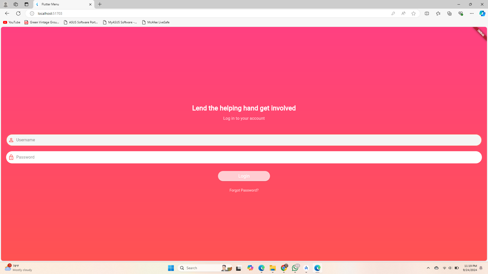
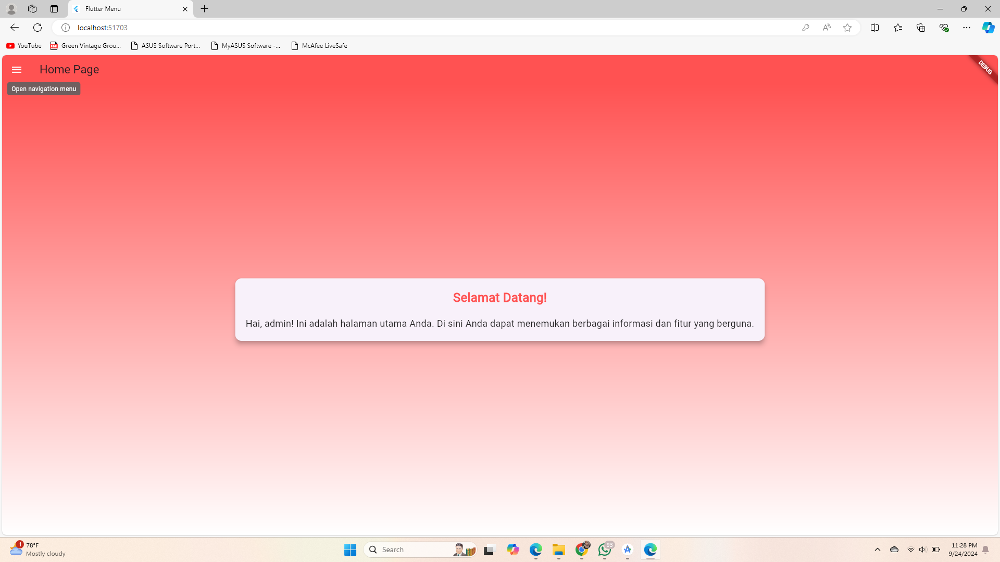
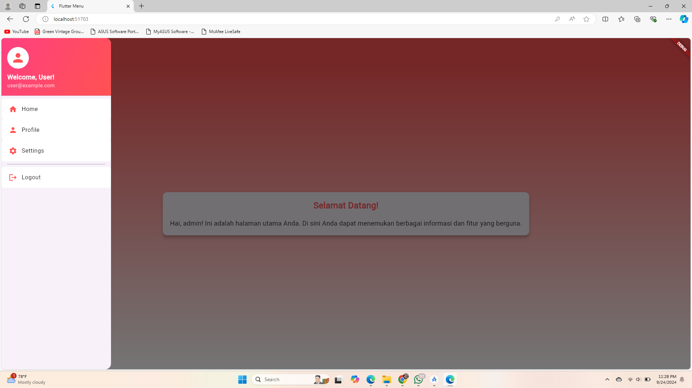
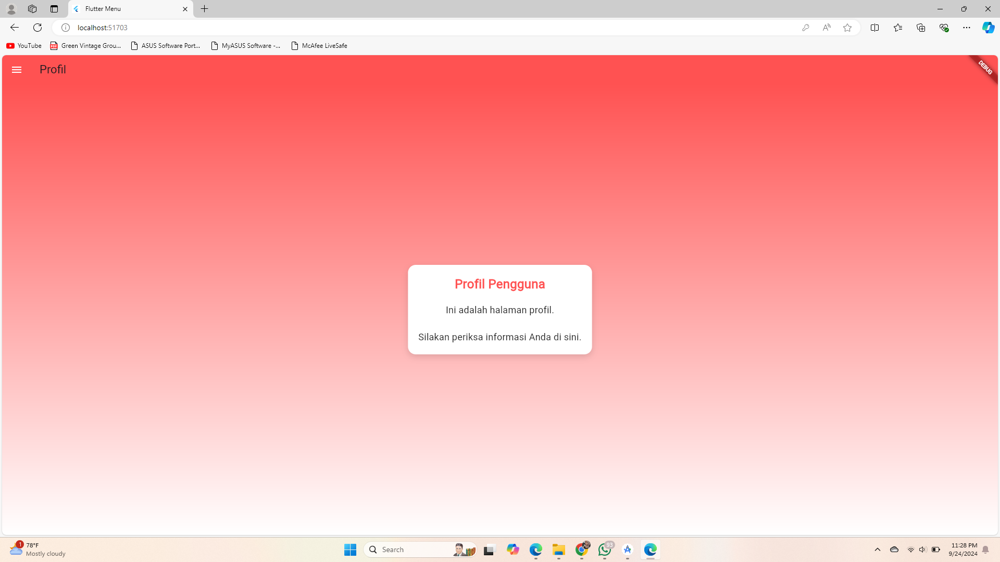
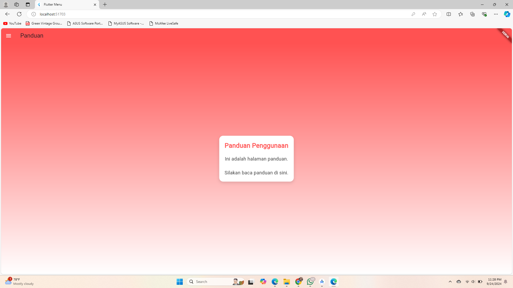

## Tugas Praktikum 3
Aplikasi ini tentang Bimbingan Konseling untuk Kesehatan Mental Healt

- [Halaman Login](#halaman-login)
- [Halaman Utama](#halaman-utama)
- [Menu Samping](#menu-samping)
- [Halaman Pengaturan](#halaman-pengaturan)
- [Halaman Profil](#halaman-profil)

## Halaman Login

`login_page.dart` memungkinkan pengguna untuk masuk dengan username dan password. 
- Menggunakan `SharedPreferences` untuk menyimpan username.
- Menampilkan dialog untuk mengonfirmasi login yang berhasil atau gagal.

## Halaman Utama

`home_page.dart` menyambut pengguna setelah login berhasil.
- Memuat username dari `SharedPreferences`.
- Menampilkan pesan selamat datang dan informasi pengguna.

## Menu Samping

`side_menu.dart` menyediakan navigasi ke berbagai halaman:
- Menampilkan avatar dan informasi sambutan di `DrawerHeader`.
- Terdapat opsi navigasi untuk Halaman Utama, Profil, dan Pengaturan.

## Halaman Pengaturan

`setting_page.dart` menampilkan panduan penggunaan aplikasi.
- Menggunakan layout dengan gradien dan kartu untuk menyampaikan informasi.

## Halaman Profil

`profile_page.dart` menampilkan informasi profil pengguna.
- Menyediakan struktur yang mirip dengan halaman pengaturan, menampilkan detail pengguna.

## Kesimpulan

Aplikasi ini memberikan struktur dasar untuk autentikasi pengguna dan navigasi dalam Flutter. 

## Screenshot

